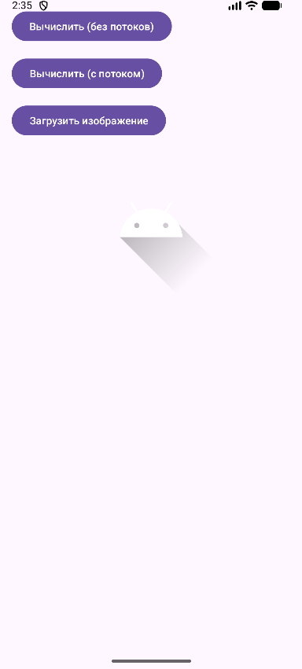
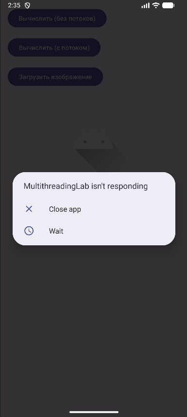
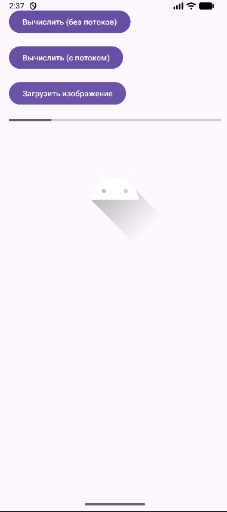
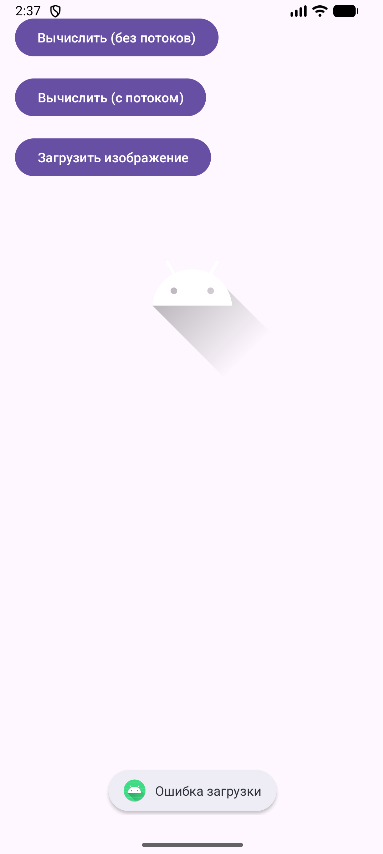
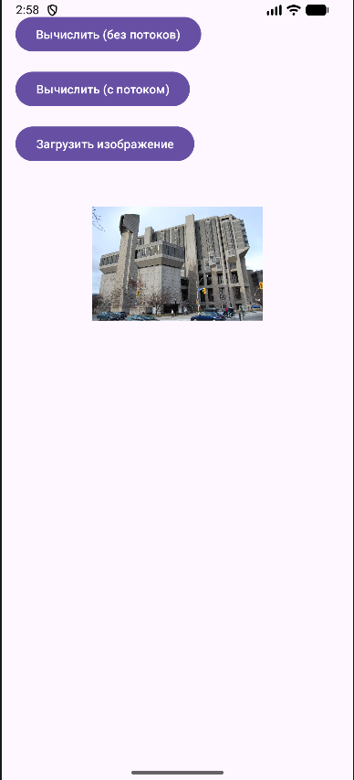
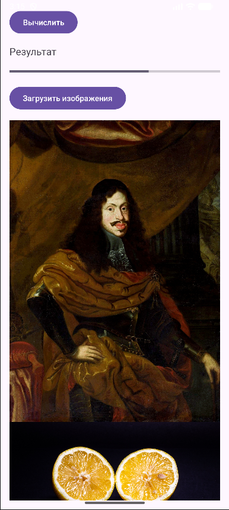
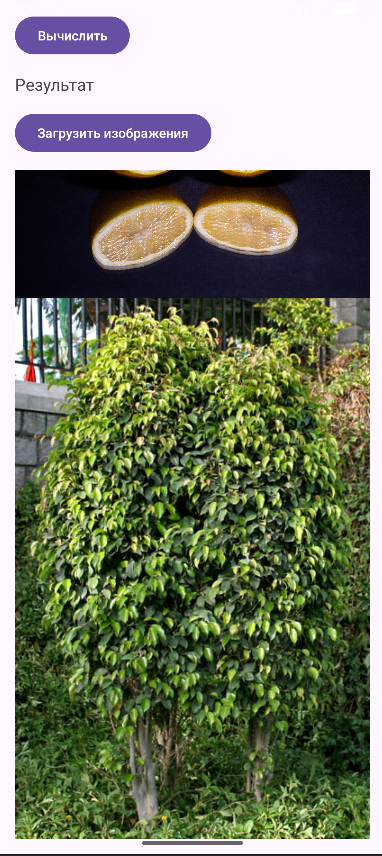
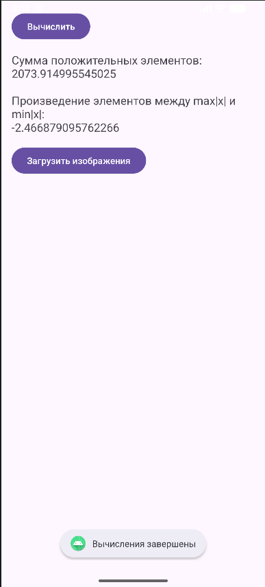

# Практическая работа №11. Многопоточность в Android. Асинхронная загрузка данных
#### Цель работы: Изучить принципы многопоточного программирования в Android. Научиться выносить длительные операции (вычисления, загрузка данных из сети) в фоновые потоки, чтобы избежать блокировки пользовательского интерфейса. Освоить способы обновления UI из фоновых потоков.

Выполнил ИНС-б-о-24-1, Пузанов Александр Александрович

### Ход выполнения практической работы:
#### 1. Создание проекта и подготовка интерфейса

#### 2. Демонстрация "зависания" интерфейса

#### 3. Выполнение вычислений в отдельном потоке
Не зависает
#### 4. Загрузка изображения из интернета с отображением прогресса
Иммитация загрузки:



Ошибка:



Загруженное изображение:


### Ход выполнения задания для самостоятельного выполнения (вариант 2):
activity_main.xml
```xml
<?xml version="1.0" encoding="utf-8"?>
<LinearLayout
xmlns:android="http://schemas.android.com/apk/res/android"
android:layout_width="match_parent"
android:layout_height="match_parent"
android:orientation="vertical"
android:padding="16dp">

<Button
    android:id="@+id/btnCalculate"
    android:layout_width="wrap_content"
    android:layout_height="wrap_content"
    android:text="Вычислить" />

<TextView
    android:id="@+id/tvResult"
    android:layout_width="match_parent"
    android:layout_height="wrap_content"
    android:text="Результат"
    android:textSize="18sp"
    android:layout_marginTop="16dp" />

<ProgressBar
    android:id="@+id/progressBar"
    style="?android:attr/progressBarStyleHorizontal"
    android:layout_width="match_parent"
    android:layout_height="wrap_content"
    android:max="100"
    android:visibility="gone"
    android:layout_marginTop="16dp" />

<Button
    android:id="@+id/btnLoadImages"
    android:layout_width="wrap_content"
    android:layout_height="wrap_content"
    android:text="Загрузить изображения"
    android:layout_marginTop="16dp" />

<ScrollView
    android:layout_width="match_parent"
    android:layout_height="0dp"
    android:layout_weight="1"
    android:layout_marginTop="16dp">

    <LinearLayout
        android:id="@+id/imagesContainer"
        android:layout_width="match_parent"
        android:layout_height="wrap_content"
        android:orientation="vertical" />
</ScrollView>

</LinearLayout>
```
MainActivity.java
```java
public class MainActivity extends AppCompatActivity {

    private static final String TAG = "Lab7";

    private TextView tvResult;
    private ProgressBar progressBar;
    private LinearLayout imagesContainer;

    @Override
    protected void onCreate(Bundle savedInstanceState) {
        super.onCreate(savedInstanceState);
        setContentView(R.layout.activity_main);

        Button btnCalculate = findViewById(R.id.btnCalculate);
        Button btnLoadImages = findViewById(R.id.btnLoadImages);
        tvResult = findViewById(R.id.tvResult);
        progressBar = findViewById(R.id.progressBar);
        imagesContainer = findViewById(R.id.imagesContainer);

        btnCalculate.setOnClickListener(v -> calculateInThread());
        btnLoadImages.setOnClickListener(v -> loadImages());
    }

    private void calculateInThread() {
        progressBar.setVisibility(View.VISIBLE);
        progressBar.setProgress(0);

        new Thread(new Runnable() {
            @Override
            public void run() {
                int n = 100;
                double[] array = new double[n];
                Random random = new Random();

                for (int i = 0; i < n; i++) {
                    array[i] = random.nextDouble() * 200 - 100;
                }

                // a. Сумма положительных элементов
                double positiveSum = Arrays.stream(array).filter(value -> value > 0).sum();

                // Индексы max|x| и min|x|
                int maxIndex = 0;
                int minIndex = 0;

                for (int i = 1; i < n; i++) {
                    if (Math.abs(array[i]) > Math.abs(array[maxIndex])) {
                        maxIndex = i;
                    }
                    if (Math.abs(array[i]) < Math.abs(array[minIndex])) {
                        minIndex = i;
                    }
                }

                // b. Произведение между ними
                int start = Math.min(maxIndex, minIndex) + 1;
                int end = Math.max(maxIndex, minIndex);

                double product = 1;

                if (start >= end) {
                    product = 0;
                } else {
                    for (int i = start; i < end; i++) {
                        product *= array[i];
                    }
                }

                Log.d(TAG, "Сумма положительных: " + positiveSum);
                Log.d(TAG, "Произведение между элементами: " + product);

                double finalProduct = product;
                runOnUiThread(new Runnable() {
                    @SuppressLint("SetTextI18n")
                    @Override
                    public void run() {
                        progressBar.setVisibility(View.GONE);

                        tvResult.setText(
                                "Сумма положительных элементов:\n" + positiveSum +
                                        "\n\nПроизведение элементов между max|x| и min|x|:\n" + finalProduct
                        );

                        Toast.makeText(MainActivity.this,
                                "Вычисления завершены",
                                Toast.LENGTH_SHORT).show();
                    }
                });
            }
        }).start();
    }

    private void loadImages() {
        String[] urls = {
                "https://upload.wikimedia.org/wikipedia/commons/2/2c/Portrait_of_Emperor_Leopold_I_National_Museum_Warsaw.jpg",
                "https://upload.wikimedia.org/wikipedia/commons/3/3f/Zitrone_--_2025_--_7294.jpg?utm_source=commons.wikimedia.org&utm_campaign=index&utm_content=original",
                "https://upload.wikimedia.org/wikipedia/commons/5/5c/Weeping_Fig_%28Ficus_benjamina%29_in_Hyderabad%2C_AP_W_IMG_7645.jpg?utm_source=commons.wikimedia.org&utm_campaign=imageinfo&utm_content=original"
        };

        progressBar.setVisibility(View.VISIBLE);
        progressBar.setProgress(0);
        imagesContainer.removeAllViews();

        new Thread(new Runnable() {
            @Override
            public void run() {
                for (int i = 0; i < urls.length; i++) {
                    try {
                        Bitmap bitmap = loadImage(urls[i]);

                        final int progress = (i + 1) * 100 / urls.length;

                        runOnUiThread(new Runnable() {
                            @Override
                            public void run() {
                                ImageView imageView = new ImageView(MainActivity.this);
                                imageView.setImageBitmap(bitmap);
                                imageView.setAdjustViewBounds(true);

                                imagesContainer.addView(imageView);
                                progressBar.setProgress(progress);

                                if (progress == 100) {
                                    progressBar.setVisibility(View.GONE);
                                }
                            }
                        });

                    } catch (Exception e) {
                        Log.e(TAG, "Ошибка загрузки", e);
                    }
                }
            }
        }).start();
    }

    private Bitmap loadImage(String urlString) throws Exception {
        URL url = new URL(urlString);
        HttpURLConnection connection =
                (HttpURLConnection) url.openConnection();
        connection.setDoInput(true);
        connection.connect();

        InputStream input = connection.getInputStream();
        Bitmap bitmap = BitmapFactory.decodeStream(input);
        input.close();

        return bitmap;
    }
}
```
#### 6. Загрузка изображений
Загрузка:



Все изображения:


#### 7. В одномерном массиве, состоящем из n вещественных элементов вычислить:
#### a. Сумму положительных элементов массива.
#### b. Произведение элементов массива, расположенных между максимальным по модулю и минимальным по модулю элементом этого массива.

### Контрольные вопросы:
1. Что такое главный (UI) поток? Почему нельзя выполнять длительные операции в нём?

Главный (UI) поток - поток, в котором работает интерфейс приложения и обработка пользовательских событий. Длительные операции в нём блокируют интерфейс и приводят к зависанию приложения.
2. Что такое ANR (Application Not Responding)? При каких условиях возникает?

ANR (Application Not Responding) - состояние, при котором приложение не отвечает на действия пользователя. Возникает, если UI поток заблокирован примерно на 5 секунд (например, из-за тяжёлых вычислений или сетевых операций).
3. Как создать новый поток в Java? Как запустить выполнение кода в этом потоке?

Новый поток в Java создаётся через Thread. Код запускается через переопределение метода run и вызов start().
4. Почему нельзя обновлять UI из фонового потока напрямую? Как правильно обновить интерфейс из другого потока? 

Обновлять UI из фонового потока нельзя из-за отсутствия потокобезопасности у UI компонентов. Правильный способ - использовать runOnUiThread, Handler или main thread executor.
5. Для чего используется класс Handler? Как с его помощью отправить сообщение в UI-поток?

Handler используется для отправки сообщений и задач в определённый поток, чаще всего в UI поток. Пример: handler.post(() -> textView.setText("text")).
6. Что такое ExecutorService? В чём его преимущество перед созданием потоков вручную?

ExecutorService - пул потоков для управления задачами. Его преимущество в переиспользовании потоков, снижении накладных расходов и более удобном управлении задачами по сравнению с ручным созданием Thread.
7. Почему AsyncTask считается устаревшим? Какие альтернативы рекомендуется использовать?

AsyncTask устарел из-за утечек памяти, проблем с жизненным циклом Activity и отсутствия гибкости. Альтернативы - ExecutorService, HandlerThread, Kotlin Coroutines.
8. Как отобразить прогресс выполнения длительной операции с помощью ProgressBar?

Почему AsyncTask считается устаревшим? Какие альтернативы рекомендуется использовать?
